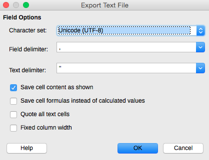

# Contributor Docs

This document is mainly for project contributors.

## Command-line Tool

The repository contains a single command-line script with a number of
commands to assist with processing and preparing the underlying data.

The script is written in Python and is contained in the
[`scripts`][path_scripts] directory.  It is designed to be run directly
from the repo root.

### Setup

You should use Python 3.4.  We also recommend first setting up a virtual
environment (e.g. using [virtualenv][virtualenv]) in which to install
dependencies.  Then--

    $ pip install Django PyYAML

### Working Locally

For command help, run the following from the repo root:

    $ python scripts/run_command.py --help

The most commonly used commands are:

    $ python scripts/run_command.py make_json

and

    $ python scripts/run_command.py sample_html

## Data Files

For organizational and communication purposes, we make a distinction in the
documentation and repo structure between two types of data files:

1. **Public data.**  The publicly useable data, which corresponds to the
   "end product" or finished product of this project.  Currently, the public
   data is a single JSON file in the [`data`][path_data] folder.
2. **Pre-data.**  The preliminary data files used to prepare the public data.
   Currently, these files are contained in the [`pre_data`][path_pre_data]
   folder.

## Public data

For documentation of the public JSON file, see [this page][path_docs_json]
of the documentation.

## Pre-data

When discussing pre-data files, we make a distinction between three types
of files:

1. **Manual.**  Manual files are maintained by hand and are never
   recreated by an automated script.  In the case of YAML files, they can
   contain YAML comments (e.g. lines that begin with a `#`).
2. **Normalizable.**  Normalizable files are also maintained by hand.
   However, we use scripts to "normalize" them (i.e. put them into a
   standard or canonical form, e.g. by alphabetizing the key values).
   Because the process of normalizing files strips YAML comments, YAML
   comments should never be added to normalizable files.
3. **Auto-generated.**  Auto-generated files are generated automatically
   from other data files.  Thus, they should never be edited by hand.

In the case of YAML files, we use a convention to indicate which type
each file is.  To assist contributors and to aid the automated tools, the
file type is indicated at the following node of each YAML file:
`data[_meta][type]`.  This value must have one of the following three
string values, corresponding to the three types: `manual`, `normalizable`,
and `auto_generated`.

## Excel Language Files

This section discusses the Excel language files from the San Francisco
Department of Elections.

After receiving the Excel files, save each "sheet" (aka tab) of the
spreadsheet as a separate CSV for more predictable parsing.
Save the CSV files to the `misc` directory.

Use the following export options (using [LibreOffice][libre_office],
for example):

* Character set: Unicode (UTF-8)
* Field delimiter: `,` (comma)
* Text delimiter: `"` (double quotes)

See also the screen shot below:

[path_data]: ../data
[path_docs_json]: json.md
[path_pre_data]: ../pre_data
[path_scripts]: ../scripts
[public_data]: develop.md
[libre_office]: http://www.libreoffice.org/
[virtualenv]: https://pypi.python.org/pypi/virtualenv/
